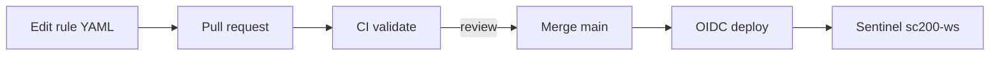
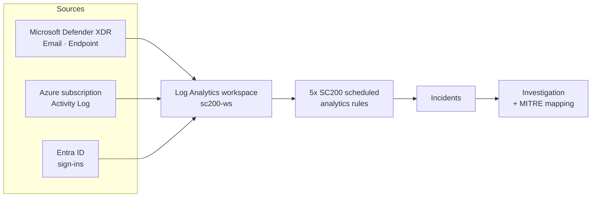

# Azure SOC Detection Lab

Detection-engineering portfolio built on a **live Microsoft Sentinel + Defender XDR** tenant. Five custom analytics rules watch Azure control-plane activity, each mapped to MITRE ATT&CK, each proven end-to-end: a benign simulated action triggers the rule, the rule raises an incident, and the incident is investigated and documented.

> Built while earning **Microsoft Certified: Security Operations Analyst Associate (SC-200)**. Workspace: `sc200-ws`. All evidence is from a personal lab tenant; tenant/subscription identifiers and any PII are redacted in screenshots.


---

## Why this exists

A detection is only credible once you can show it firing. This repo closes that loop for five Azure-focused detections: **rule logic → simulated trigger → generated incident → investigation → MITRE mapping.** It is the hands-on companion to SC-200 — Sentinel analytics rules, KQL, and incident response against real telemetry rather than synthetic samples.

## Detection-as-Code

The rules are not clicked into the portal — they are **versioned YAML deployed by a PR-gated pipeline**. Editing a detection means opening a pull request; CI validates it, a reviewer approves, merge to `main` deploys it to Sentinel via **OIDC (no stored secrets)**, idempotently by rule GUID (API `2025-09-01`).



- Source of truth: [`detections/rules/*.yaml`](detections/rules) · Pipeline: [`.github/workflows/deploy-detections.yml`](.github/workflows/deploy-detections.yml) · Deployer/validator: [`cicd/`](cicd) · Details: [docs/03-cicd.md](docs/03-cicd.md)


A real change went through it: [PR #1](https://github.com/ibondarenko1/azure-soc-detection-lab/pull/1) tightened the SC200-01 threshold (10 → 8); CI validated it, merge deployed it to the live `sc200-ws` rule. That step — *rules deploy automatically from git by reviewed PR* — is what separates a detection **engineer** from an analyst who finished a course.

## Lab architecture




## Detection catalog

| ID | Detection | Severity | MITRE tactic | Technique |
|----|-----------|----------|--------------|-----------|
| [SC200-01](detections/SC200-01-failed-activity-log-spike.md) | Failed Activity Log operations spike | Medium | Discovery | [T1087](https://attack.mitre.org/techniques/T1087/) Account Discovery |
| [SC200-02](detections/SC200-02-nsg-rule-modified.md) | Network Security Group rule modified | Medium | Defense Evasion | [T1562](https://attack.mitre.org/techniques/T1562/) Impair Defenses |
| [SC200-03](detections/SC200-03-rbac-role-assignment-changes.md) | RBAC role assignment changes | Medium | Privilege Escalation / Persistence | [T1098](https://attack.mitre.org/techniques/T1098/) Account Manipulation |
| [SC200-04](detections/SC200-04-mass-resource-deletion.md) | Mass resource deletion | **High** | Impact | [T1485](https://attack.mitre.org/techniques/T1485/) Data Destruction |
| [SC200-05](detections/SC200-05-suspicious-deployment-non-owner.md) | Suspicious resource deployment by non-owner | Medium | Persistence | [T1098](https://attack.mitre.org/techniques/T1098/) Account Manipulation |


## Results

Each detection was triggered with a benign, self-reverted administrative action and produced a real incident:


Two incidents are written up as full investigations:
- [INV-01 — Mass resource deletion (High)](investigations/INV-01-mass-resource-deletion.md)
- [INV-02 — RBAC privilege escalation](investigations/INV-02-rbac-privilege-escalation.md)

## Repository layout

```
detections/rules  rule source-of-truth (Sentinel YAML, deployed by CI)
detections/*.md   one card per rule: logic, MITRE, trigger, evidence
cicd/ + .github   Detection-as-Code pipeline (deploy, validate, regression)
sigma/            vendor-neutral Sigma conversions (portable to any SIEM)
kql/              analytics-rule queries + hunting library
investigations/   end-to-end incident write-ups
simulations/      exact atomic-aligned trigger steps
docs/             architecture · methodology · cicd · validation
screenshots/      visual evidence
```

## Skills demonstrated

KQL · Microsoft Sentinel scheduled analytics rules · Microsoft Defender XDR · Detection-as-Code (GitHub Actions, OIDC) · Sigma (vendor-neutral) · Atomic Red Team validation · incident triage & investigation · MITRE ATT&CK mapping · Azure control-plane (Activity Log) monitoring.

## Disclaimer

Personal lab tenant. Every "attack" here is a benign administrative action performed against my own resources and reverted immediately. No production systems, no third parties. Identifiers and PII are redacted in all screenshots.

## License

[MIT](LICENSE)
