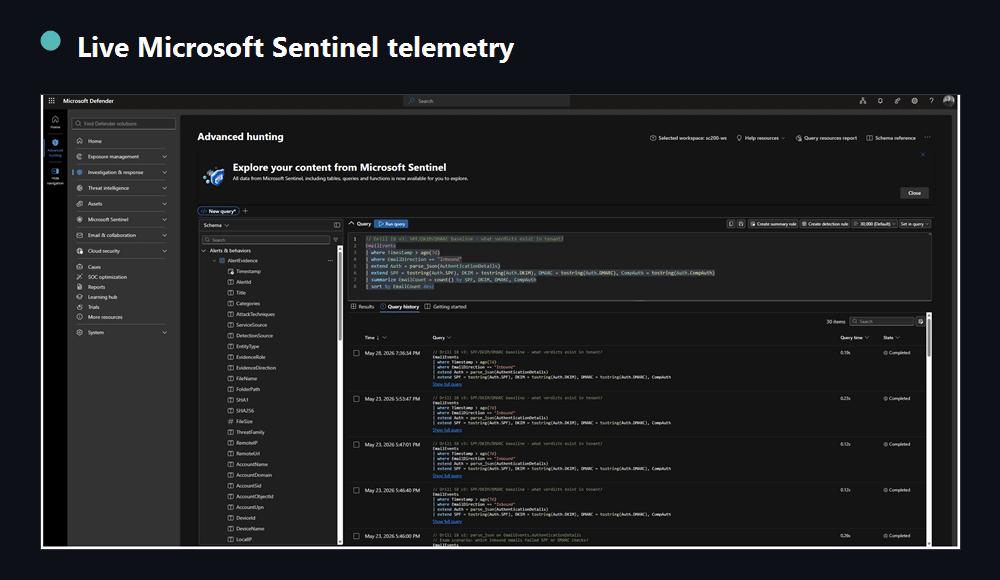
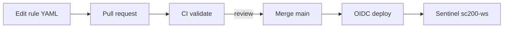
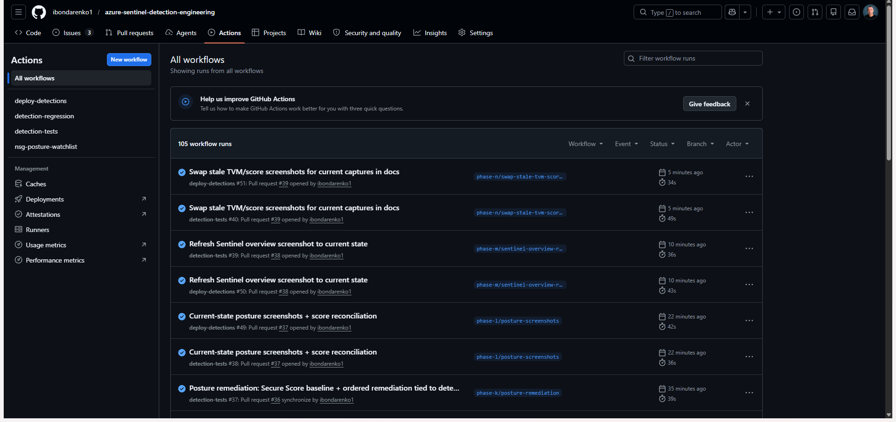
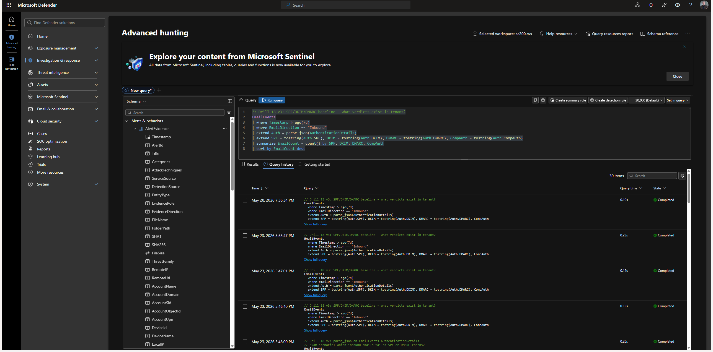
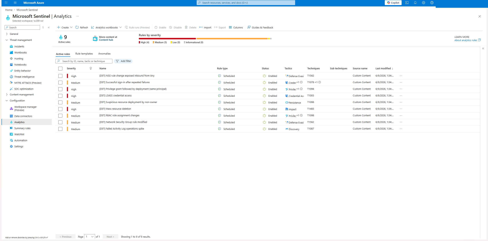
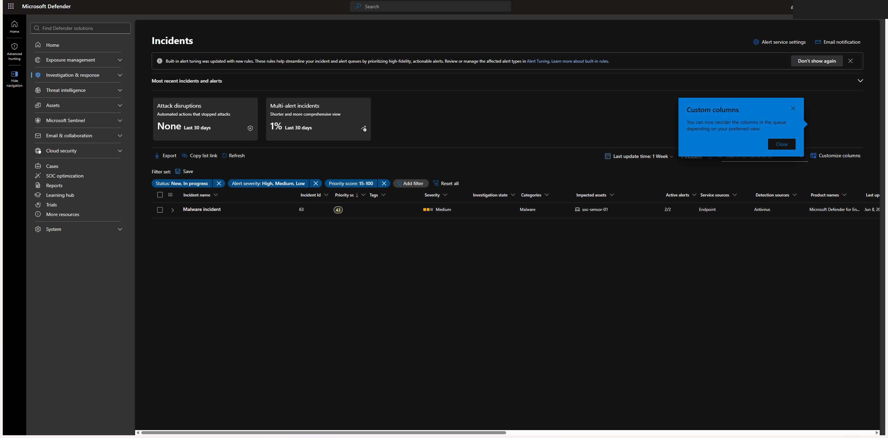

# Azure Sentinel Detection Engineering

Detection engineering on a live Microsoft Sentinel and Defender XDR environment I operate. Five custom analytics rules watch Azure control-plane activity, each mapped to MITRE ATT&CK and proven end to end: a controlled benign action triggers the rule, the rule raises an incident, and the incident gets investigated and documented. A sixth rule extends the same pipeline to the endpoint plane (Defender for Endpoint), with Defender Vulnerability Management feeding a hunting library.



> A live single-tenant environment I operate end to end. Tenant and subscription identifiers and any PII are redacted in all screenshots.


---

## Why this exists

A detection is only credible once you can show it firing. This repo closes that loop across the Azure control plane and the endpoint: rule logic, controlled trigger, generated incident, investigation, and MITRE mapping. It is Sentinel analytics rules, KQL, and incident response against real telemetry rather than synthetic samples.

## Detection-as-Code

The rules are not clicked into the portal. They are **versioned YAML deployed by a PR-gated pipeline**. Editing a detection means opening a pull request; CI validates it, a reviewer approves, and merge to `main` deploys it to Sentinel via **OIDC (no stored secrets)**, idempotently by rule GUID (API `2025-09-01`).



- Source of truth: [`detections/rules/*.yaml`](detections/rules) · Pipeline: [`.github/workflows/deploy-detections.yml`](.github/workflows/deploy-detections.yml) · Deployer/validator: [`cicd/`](cicd) · Details: [docs/03-cicd.md](docs/03-cicd.md)



A real change went through it: [PR #1](https://github.com/ibondarenko1/azure-sentinel-detection-engineering/pull/1) tightened the DET-001 threshold (10 to 8); CI validated it, and the merge deployed it to the live `sc200-ws` rule. That step, rules deploying automatically from git by reviewed PR, is what separates a detection **engineer** from an analyst who finished a course.

## Architecture




## Detection catalog

| ID | Detection | Severity | MITRE tactic | Technique |
|----|-----------|----------|--------------|-----------|
| [DET-001](detections/DET-001-failed-activity-log-spike.md) | Failed Activity Log operations spike | Medium | Discovery | [T1087](https://attack.mitre.org/techniques/T1087/) Account Discovery |
| [DET-002](detections/DET-002-nsg-rule-modified.md) | Network Security Group rule modified | Medium | Defense Evasion | [T1562](https://attack.mitre.org/techniques/T1562/) Impair Defenses |
| [DET-003](detections/DET-003-rbac-role-assignment-changes.md) | RBAC role assignment changes | Medium | Privilege Escalation / Persistence | [T1098](https://attack.mitre.org/techniques/T1098/) Account Manipulation |
| [DET-004](detections/DET-004-mass-resource-deletion.md) | Mass resource deletion | **High** | Impact | [T1485](https://attack.mitre.org/techniques/T1485/) Data Destruction |
| [DET-005](detections/DET-005-suspicious-deployment-non-owner.md) | Suspicious resource deployment by non-owner | Medium | Persistence | [T1098](https://attack.mitre.org/techniques/T1098/) Account Manipulation |
| [DET-006](detections/DET-006-lsass-credential-access.md) | LSASS credential access (endpoint, witness pending) | **High** | Credential Access | [T1003.001](https://attack.mitre.org/techniques/T1003/001/) LSASS Memory |



## Results

Each detection was triggered with a controlled, self-reverted administrative action and produced a real incident:



Two incidents are written up as full investigations:
- [INV-01, Mass resource deletion (High)](investigations/INV-01-mass-resource-deletion.md)
- [INV-02, RBAC privilege escalation](investigations/INV-02-rbac-privilege-escalation.md)

## ATT&CK coverage

A coverage map with explicit gaps is more honest than a list of rules. The [ATT&CK Navigator layer](navigator/coverage-layer.json) ([how to load](navigator/README.md)) shows both:

| Covered (deployed rule) | Known gap, tracked as an issue |
|-------------------------|---------------------------------|
| T1087 Account Discovery (DET-001) | [T1078 Valid Accounts](../../issues/10), sign-in anomaly |
| T1562.007 Disable/Modify Cloud Firewall (DET-002) | [T1110 Brute Force](../../issues/11), auth-failure correlation |
| T1098.003 Additional Cloud Roles (DET-003) | [T1530 Data from Cloud Storage](../../issues/12), data-plane detection |
| T1485 Data Destruction (DET-004) | [T1496 Resource Hijacking](../../issues/13), spend/mining anomaly |
| T1098 Account Manipulation (DET-003 / DET-005) | [T1526 Cloud Service Discovery](../../issues/14), strengthen heuristic |

The gaps are not static text. Each one is a live [`detection-gap` issue](../../issues?q=is%3Aissue+label%3Adetection-gap), so the roadmap is a clickable backlog.

## Automated response (SOAR)

The highest-severity detection closes the loop from detect to respond. A Sentinel automation rule runs a [Logic App playbook](playbooks/mass-deletion-response) on every DET-004 (mass deletion) incident: it posts an enrichment comment with the recommended containment (disable the caller, lock the resource groups, restore, hunt). The playbook authenticates with its own **managed identity** straight to the ARM API, with no secrets and no external connector.

## Endpoint and vulnerability management

The detections start on the Azure control plane; this phase adds the endpoint plane. A Defender for Endpoint sensor on a Windows server feeds the same workspace, so the Detection-as-Code pipeline deploys an endpoint rule, [DET-006 LSASS credential access](detections/DET-006-lsass-credential-access.md), next to the control-plane rules. Defender Vulnerability Management adds a second input: a [hunting library](kql/hunting) that surfaces critical CVEs on servers, failed secure-configuration baselines, and vulnerable assets under active alert. The `DeviceTvm*` tables live only in Defender advanced hunting, so those correlations are hunts, not deployed rules, and the repo says where each query actually runs. Architecture and data flow: [docs/07](docs/07-endpoint-vulnerability-management.md).

## Repository layout

```
detections/rules  rule source-of-truth (Sentinel YAML, deployed by CI)
detections/*.md   one card per rule: logic, MITRE, trigger, evidence
detections/metrics.yaml  per-detection metrics (volume, FP rate, TP, MTTD)
tests/            synthetic-log unit tests (Kusto emulator, fork-runnable)
cicd/ + .github   Detection-as-Code pipeline (deploy, validate, regression)
sigma/            vendor-neutral Sigma conversions (portable to any SIEM)
kql/              analytics-rule queries + hunting library
investigations/   end-to-end incident write-ups
simulations/      exact atomic-aligned trigger steps
navigator/        ATT&CK coverage layer (covered + gaps)
playbooks/        SOAR response (Logic App + automation rule)
docs/             architecture, methodology, cicd, validation, data-dictionary, endpoint+TVM
screenshots/      visual evidence
```

## Skills demonstrated

KQL · Microsoft Sentinel scheduled analytics rules · Microsoft Defender XDR · Microsoft Defender for Endpoint · Defender Vulnerability Management (TVM) · advanced hunting (Device tables) · Detection-as-Code (GitHub Actions, OIDC) · SOAR (Logic Apps automation rules) · Sigma (vendor-neutral) · Atomic Red Team validation · incident triage and investigation · MITRE ATT&CK mapping · Azure control-plane (Activity Log) monitoring.

## Credentials

Microsoft Certified: Security Operations Analyst Associate (SC-200).

## Disclaimer

An environment I operate, not a production tenant of any employer or third party. Detections are validated with controlled, self-reverted administrative actions against my own resources; no production systems and no third parties are involved. Tenant and subscription identifiers and PII are redacted in all screenshots.

## License

[MIT](LICENSE)
