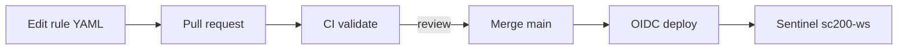
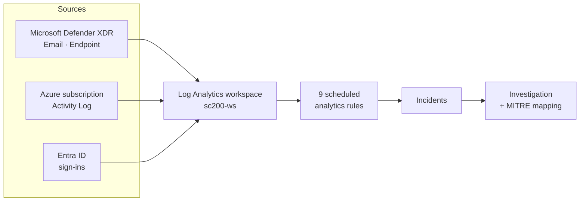
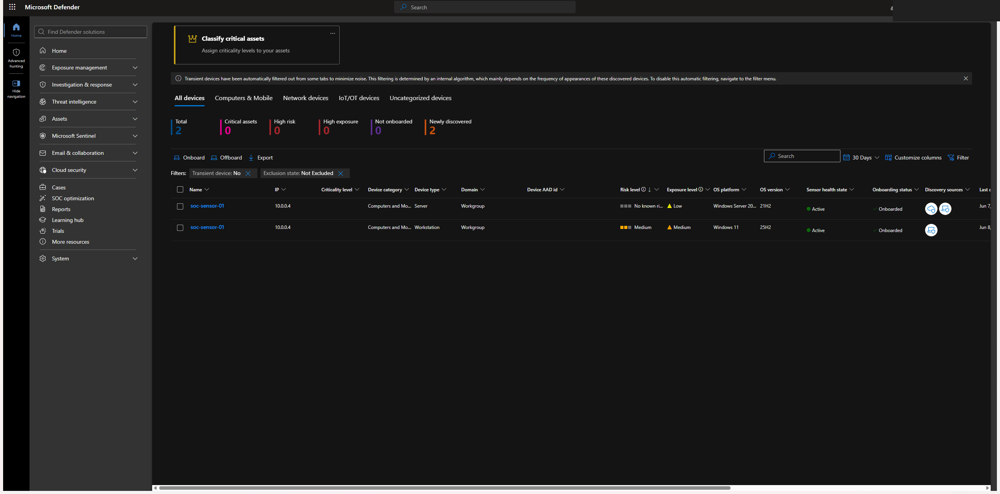
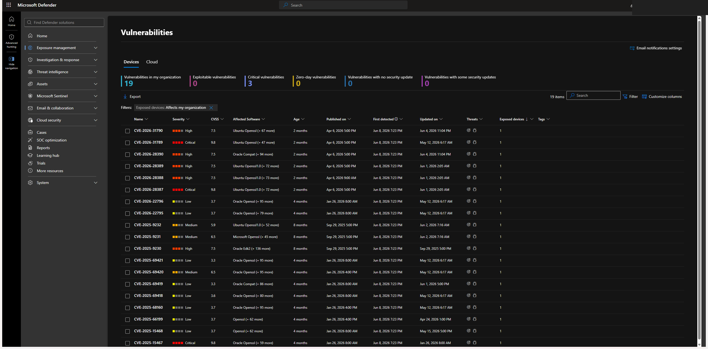

# Azure Sentinel Detection Engineering

Detection engineering on a live Microsoft Sentinel and Defender XDR environment I operate. Nine custom analytics rules span three planes, each mapped to MITRE ATT&CK and proven end to end: a controlled action triggers the rule, the rule raises an incident, and the incident gets investigated and documented. Seven watch the Azure **control plane** (`AzureActivity`), including a multi-stage correlation and an ARG-backed content rule; one watches the **endpoint** (Defender for Endpoint), with Defender Vulnerability Management feeding a hunting library; one watches **identity** (Entra ID `SigninLogs`). All deployed by the same PR-gated pipeline.


> A live single-tenant environment I operate end to end. Tenant and subscription identifiers and any PII are redacted in all screenshots.


---

## Why this exists

A detection is only credible once you can show it firing. This repo closes that loop across three planes, the Azure control plane, the endpoint, and identity: rule logic, controlled trigger, generated incident, investigation, and MITRE mapping. It goes past single-event rules with a multi-stage correlation (grant then deploy) and a content-aware rule that joins Azure Resource Graph posture to the change event. It is Sentinel analytics rules, KQL, and incident response against real telemetry rather than synthetic samples.

## Detection-as-Code

The rules are not clicked into the portal. They are **versioned YAML deployed by a PR-gated pipeline**. Editing a detection means opening a pull request; CI validates it, a reviewer approves, and merge to `main` deploys it to Sentinel via **OIDC (no stored secrets)**, idempotently by rule GUID (API `2025-09-01`).



- Source of truth: [`detections/rules/*.yaml`](detections/rules) · Pipeline: [`.github/workflows/deploy-detections.yml`](.github/workflows/deploy-detections.yml) · Deployer/validator: [`cicd/`](cicd) · Details: [docs/03-cicd.md](docs/03-cicd.md)


A real change went through it: [PR #1](https://github.com/ibondarenko1/azure-sentinel-detection-engineering/pull/1) tightened the DET-001 threshold (10 to 8); CI validated it, and the merge deployed it to the live `sc200-ws` rule. That step, rules deploying automatically from git by reviewed PR, is what separates a detection **engineer** from an analyst who finished a course.

## Architecture




## Detection catalog

| ID | Detection | Severity | MITRE tactic | Technique |
|----|-----------|----------|--------------|-----------|
| [DET-001](detections/DET-001-failed-activity-log-spike.md) | Failed Activity Log operations spike | Medium | Discovery | [T1087](https://attack.mitre.org/techniques/T1087/) Account Discovery |
| [DET-002](detections/DET-002-nsg-rule-modified.md) | Network Security Group rule modified | Medium | Defense Evasion | [T1562](https://attack.mitre.org/techniques/T1562/) Impair Defenses |
| [DET-003](detections/DET-003-rbac-role-assignment-changes.md) | RBAC role assignment changes | Medium | Privilege Escalation / Persistence | [T1098](https://attack.mitre.org/techniques/T1098/) Account Manipulation |
| [DET-004](detections/DET-004-mass-resource-deletion.md) | Mass resource deletion | **High** | Impact | [T1485](https://attack.mitre.org/techniques/T1485/) Data Destruction |
| [DET-005](detections/DET-005-suspicious-deployment-non-owner.md) | Suspicious resource deployment by non-owner | Medium | Persistence | [T1098](https://attack.mitre.org/techniques/T1098/) Account Manipulation |
| [DET-006](detections/DET-006-lsass-credential-access.md) | LSASS credential access (endpoint) | **High** | Credential Access | [T1003.001](https://attack.mitre.org/techniques/T1003/001/) LSASS Memory |
| [DET-007](detections/DET-007-rbac-grant-then-deploy.md) | Privilege grant followed by deployment (correlation) | **High** | Privilege Escalation / Persistence | [T1098](https://attack.mitre.org/techniques/T1098/) Account Manipulation |
| [DET-008](detections/DET-008-signin-success-after-failures.md) | Successful sign-in after repeated failures (identity) | Medium | Credential Access / Initial Access | [T1110](https://attack.mitre.org/techniques/T1110/) Brute Force, [T1078](https://attack.mitre.org/techniques/T1078/) Valid Accounts |
| [DET-009](detections/DET-009-nsg-opened-inbound-any.md) | NSG rule change exposed inbound from Any (ARG content) | **High** | Defense Evasion | [T1562.007](https://attack.mitre.org/techniques/T1562/007/) Disable/Modify Cloud Firewall |


## Results

Each detection was triggered with a controlled, self-reverted administrative action and produced a real incident:


Five incidents are written up as full investigations:
- [INV-01, Mass resource deletion (High)](investigations/INV-01-mass-resource-deletion.md)
- [INV-02, RBAC privilege escalation](investigations/INV-02-rbac-privilege-escalation.md)
- [INV-03, LSASS credential access (High)](investigations/INV-03-lsass-credential-access.md), endpoint, Incident #65
- [INV-04, NSG opened inbound from Any (High)](investigations/INV-04-nsg-opened-inbound.md), ARG content correlation (DET-009)
- [INV-05, Privilege grant then deployment (High)](investigations/INV-05-grant-then-deploy.md), multi-stage correlation (DET-007)

Beyond one-off triggers, a [validation harness](validation/) drives a real **benign + attack** batch in the tenant and runs each rule's KQL against it, so false positives are **measured, not assumed**. Latest run ([results](validation/RESULTS.md)): 5/5 attack scenarios fired (DET-002/003/004/007/009) and 0 false fires on the benign stream (allow-listed owner deploy, sub-threshold deletes, deploy-without-grant). It does not fake production volume; it converts "0% FP at N=1" into a measured "0 false fires over a real benign batch".

## ATT&CK coverage

A coverage map with explicit gaps is more honest than a list of rules. The [ATT&CK Navigator layer](navigator/coverage-layer.json) ([how to load](navigator/README.md)) shows both:

| Covered (deployed rule) | Known gap, tracked as an issue |
|-------------------------|---------------------------------|
| T1087 Account Discovery (DET-001) | [T1530 Data from Cloud Storage](../../issues/12), data-plane detection |
| T1562.007 Disable/Modify Cloud Firewall (DET-002 / DET-009) | [T1496 Resource Hijacking](../../issues/13), spend/mining anomaly |
| T1098 Account Manipulation (DET-003 / DET-005 / DET-007) | [T1526 Cloud Service Discovery](../../issues/14), strengthen heuristic |
| T1485 Data Destruction (DET-004) | |
| T1003.001 LSASS Memory (DET-006) | |
| T1110 Brute Force / T1078 Valid Accounts (DET-008) | |

The gaps are not static text. Each one is a live [`detection-gap` issue](../../issues?q=is%3Aissue+label%3Adetection-gap), so the roadmap is a clickable backlog.

**Why these rules and not others:** [docs/08, detection strategy and threat model](docs/08-detection-strategy.md) maps the catalog to a cloud kill chain and risk-ranks the gaps. **How a rule gets tuned:** [docs/09, a measured DET-005 tuning loop](docs/09-tuning-case-study.md) takes a rule from "fires on every write" to a measured zero false positives on the validation harness.

## Automated response (SOAR)

The highest-severity detection closes the loop from detect to respond. A Sentinel automation rule runs a [Logic App playbook](playbooks/mass-deletion-response) on every DET-004 (mass deletion) incident: it posts an enrichment comment with the recommended containment (disable the caller, lock the resource groups, restore, hunt). The playbook authenticates with its own **managed identity** straight to the ARM API, with no secrets and no external connector.

A second playbook extends the loop into **detect → respond → AI-investigate** with **Microsoft Security Copilot**: a [promptbook + Logic App](playbooks/copilot-triage) invokes a Copilot promptbook on the same DET-004 incident and posts an AI investigation summary as a comment. It is built and deploys without any compute units; the live AI-summary capture runs in a single cost-bounded (~$4) paid window and is not claimed until captured. Cost and teardown runbook: [docs/06](docs/06-security-copilot.md).

## Endpoint and vulnerability management

The detections start on the Azure control plane; this phase adds the endpoint plane. A Defender for Endpoint sensor on a Windows host feeds the same workspace, so the Detection-as-Code pipeline deploys an endpoint rule, [DET-006 LSASS credential access](detections/DET-006-lsass-credential-access.md), next to the control-plane rules. DET-006 is multi-source and witnessed: three credential-dump techniques were run against the sensor, the hardened host (LSASS RunAsPPL, AMSI, behavioral protection) prevented every one, and the rule fired on the resulting Defender alerts to raise an incident ([INV-03](investigations/INV-03-lsass-credential-access.md)). Defender Vulnerability Management adds a second input: a [hunting library](kql/hunting) that surfaces critical CVEs by exposed software, failed secure-configuration baselines, and vulnerable assets under active alert. The `DeviceTvm*` tables live only in Defender advanced hunting, so those correlations are hunts, not deployed rules, and the repo says where each query actually runs. Architecture and data flow: [docs/07](docs/07-endpoint-vulnerability-management.md).





## Repository layout

```
detections/rules  rule source-of-truth (Sentinel YAML, deployed by CI)
detections/*.md   one card per rule: logic, MITRE, trigger, evidence
detections/metrics.yaml  per-detection metrics (volume, FP rate, TP, MTTD)
tests/            synthetic-log unit tests (Kusto emulator, fork-runnable)
validation/       live mixed-activity harness: benign + attack streams, measured TP/FP
cicd/ + .github   Detection-as-Code pipeline (deploy, validate, regression)
sigma/            vendor-neutral Sigma conversions (portable to any SIEM)
kql/              analytics-rule queries + hunting library
investigations/   end-to-end incident write-ups
simulations/      exact atomic-aligned trigger steps
navigator/        ATT&CK coverage layer (covered + gaps)
playbooks/        SOAR response (Logic App + automation rule)
docs/             architecture, methodology, cicd, validation, data-dictionary, endpoint+TVM, detection-strategy, tuning case study
screenshots/      visual evidence
```

## Skills demonstrated

KQL · Microsoft Sentinel scheduled analytics rules · multi-stage correlation rules · Entra ID identity detection (SigninLogs) · allow-list watchlists (`_GetWatchlist`) · Azure Resource Graph posture-as-content (scheduled Action) · Microsoft Defender XDR · Microsoft Defender for Endpoint · Defender Vulnerability Management (TVM) · advanced hunting (Device / DeviceTvm tables) · Detection-as-Code (GitHub Actions, OIDC) · SOAR (Logic Apps automation rules) · Sigma (vendor-neutral) · Atomic Red Team validation · incident triage and investigation · MITRE ATT&CK mapping · Azure control-plane (Activity Log) monitoring.

## Credentials

Microsoft Certified: Security Operations Analyst Associate (SC-200).

## Disclaimer

An environment I operate, not a production tenant of any employer or third party. Detections are validated with controlled, self-reverted administrative actions against my own resources; no production systems and no third parties are involved. Tenant and subscription identifiers and PII are redacted in all screenshots.

## License

[MIT](LICENSE)
