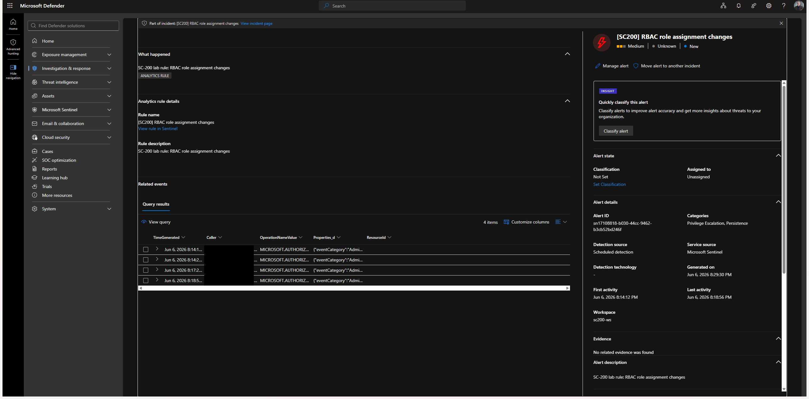

# DET-003, RBAC role assignment changes

| | |
|---|---|
| **ID** | DET-003 |
| **Severity** | Medium |
| **Rule type** | Scheduled analytics rule |
| **Status** | Enabled |
| **Data source** | `AzureActivity` |
| **MITRE tactic** | Privilege Escalation / Persistence |
| **MITRE technique** | [T1098, Account Manipulation](https://attack.mitre.org/techniques/T1098/) |

## What it catches

Creation of an Azure **RBAC role assignment**. Granting a role (especially Owner/Contributor/User Access Administrator) to a new principal is a primary privilege-escalation and persistence mechanism in the cloud, it survives password resets and is easy to overlook. Every role grant is surfaced for review.

## Detection logic

Exact rule logic (exported from the analytics rule). Runs every 30 minutes over a 1-hour lookback. Matches both role-assignment **writes** and **deletes** (any `roleAssignments` operation).

```kql
AzureActivity
| where TimeGenerated > ago(1h)
| where OperationNameValue has "Microsoft.Authorization/roleAssignments"
| where ActivityStatusValue == "Success"
| project TimeGenerated, Caller, OperationNameValue, Properties_d, ResourceId
```

## How to trigger (simulation)

See `simulations/trigger-playbook.md` → **DET-003**. Summary: Subscription/RG → Access control (IAM) → **Add role assignment** → Reader → assign to a user/second account → then **Remove** it.

## Expected result

**Confirmed:** incident **#2** (Medium) raised 2026-06-07 ~03:29 UTC, `roleAssignments/write` (Reader) + delete on scope `rg-soc-sim`, caller `ievgen@<redacted-tenant>`.

## Evidence



Full investigation: [INV-02](../investigations/INV-02-rbac-privilege-escalation.md).

## Tuning notes

**Threshold rationale.** No count threshold, every successful `roleAssignments` write/delete is reviewed, since one grant can be full persistence.

**Known false positives.** Routine access administration / onboarding; PIM eligible-role activations; group-membership-driven access reviews.

**Tightening trade-off.** Filtering to only Owner/Contributor/User Access Administrator (vs Reader) cuts volume sharply but misses scoped-but-sensitive data roles (e.g. Key Vault / Storage data roles) that also enable abuse.

**Evasion.** A patient actor uses **PIM eligible** assignments (activate later), modifies an *existing* assignment's scope, grants via group membership, or assigns a custom role with an innocuous name. Enrich with the role granted and the caller's own privilege.

**Validation.** ATT&CK [T1098.003](https://attack.mitre.org/techniques/T1098/003/), Additional Cloud Roles; see [docs/04-validation.md](../docs/04-validation.md).
