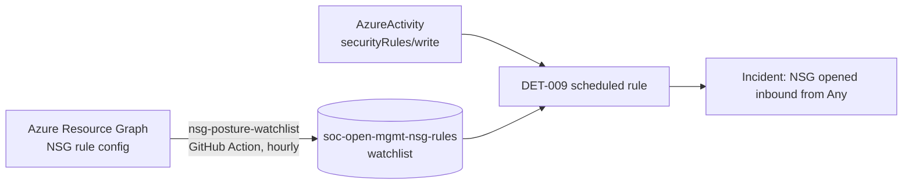

# DET-009, NSG rule change exposed inbound from Any

| | |
|---|---|
| **ID** | DET-009 |
| **Severity** | **High** |
| **Rule type** | Scheduled analytics rule (content-level companion to DET-002) |
| **Status** | Enabled |
| **Data source** | `AzureActivity` + `soc-open-mgmt-nsg-rules` watchlist (Azure Resource Graph) |
| **MITRE tactic** | Defense Evasion |
| **MITRE technique** | [T1562.007 Disable or Modify Cloud Firewall](https://attack.mitre.org/techniques/T1562/007/) |

## Why this exists

[DET-002](DET-002-nsg-rule-modified.md) fires on *any* NSG `securityRules` change by a
non-automation principal, but the Activity Log does **not** carry the rule body, so DET-002 cannot
tell whether the change actually opened anything (documented data boundary). DET-009 closes that:
it sources the rule **content** from Azure Resource Graph and fires only when a change event lands
on an NSG that is **currently exposing inbound Allow-from-Any**. The two rules are complementary,
DET-002 = "an NSG was touched", DET-009 = "an NSG was touched and it is now open".

## Data path



A scheduled [GitHub Action](../.github/workflows/nsg-posture-watchlist.yml) runs an ARG query for
NSG rules with `access == Allow`, `direction == Inbound`, and `sourceAddressPrefix in (*, Internet,
0.0.0.0/0)`, and writes the offending NSGs to the `soc-open-mgmt-nsg-rules` watchlist (OIDC, no
secrets). This is the data DET-002 could not reach, brought into the workspace where a scheduled
rule can join it.

## Detection logic

```kql
let openNsgs = _GetWatchlist('soc-open-mgmt-nsg-rules') | project SearchKey;
AzureActivity
| where TimeGenerated > ago(1h)
| where OperationNameValue has "Microsoft.Network/networkSecurityGroups/securityRules"
| where OperationNameValue endswith "/write"
| where ActivityStatusValue == "Success"
| extend NsgName = tostring(split(tostring(Properties_d.resource), "/")[0])
| where NsgName in~ (openNsgs)
| extend CallerIp = tostring(parse_json(tostring(Properties_d.httpRequest)).clientIpAddress)
| project TimeGenerated, Caller, CallerIp, NsgName, OperationNameValue, ResourceId
```

`Properties_d.resource` is `"<nsg>/<rule>"` in the real record; the NSG name is the first segment,
joined case-insensitively against the watchlist.

## How to trigger (simulation)

Create an NSG inbound rule `Allow` from `*` on 3389, let the posture Action (or a manual ARG
refresh) populate the watchlist, and the next rule run correlates the change. Then delete the rule.

## Expected result

Fires when a successful `securityRules/write` targets an NSG present in `soc-open-mgmt-nsg-rules`;
silent for a write on a non-open NSG, a non-securityRules op, or a failure (see
`tests/fixtures/DET-009.json`).

## Tuning notes

- The watchlist is the source of truth for "open"; tune the ARG query (e.g. restrict to management
  ports 22/3389/5985, or exclude a documented jump-host NSG) to shape fidelity.
- Pairs with DET-002: DET-002 catches the actor (any non-automation NSG change), DET-009 confirms the
  consequence (it is open). Triage them together.

**Evasion.** Opening via a route table / Azure Firewall instead of an NSG, or a rule that is open but
not on a watched port if the ARG query is port-restricted.

**Validation.** Fixture fire/silent in `tests/fixtures/DET-009.json` (run by `tests/run-detection-tests.py`
with the watchlist stubbed); ATT&CK [T1562.007](https://attack.mitre.org/techniques/T1562/007/).
