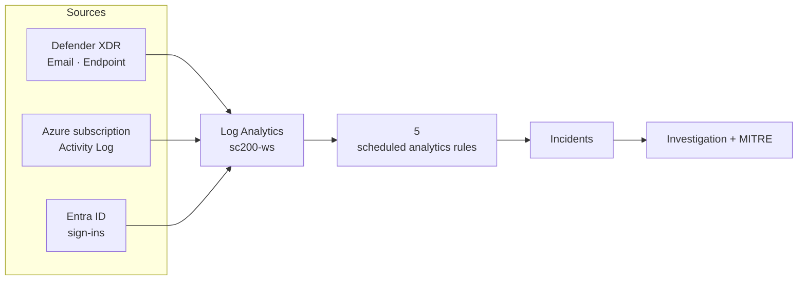

# Architecture

## Tenant & workspace

- **Platform:** Microsoft Defender XDR with integrated Microsoft Sentinel (unified `security.microsoft.com` portal).
- **Log Analytics workspace:** `sc200-ws`.
- **Tenant:** environment I operate (identifiers redacted in all evidence).

## Data sources feeding the workspace

| Source | Key tables | Used by |
|--------|-----------|---------|
| Azure subscription Activity Log | `AzureActivity` | the 6 control-plane detections (DET-001 to 005, and the DET-007 correlation) |
| Microsoft Entra ID | `SigninLogs`, `AuditLogs` | DET-008 identity detection |
| Microsoft Defender for Office 365 | `EmailEvents`, `EmailUrlInfo`, `UrlClickEvents`, `CampaignInfo` | hunting library |
| Microsoft Defender for Endpoint | `Device*`, `DeviceTvm*` | DET-006 + hunting |
| Microsoft Defender XDR | `AlertInfo`, `AlertEvidence`, `BehaviorInfo` | enrichment |
| Security Exposure Management | `ExposureGraphNodes`, `ExposureGraphEdges` | posture context |

## Data flow

## Detection surface

All five v1 detections operate on the Azure **control plane** via the `AzureActivity` table, the highest-signal source for cloud administrative abuse (privilege changes, defensive-control tampering, destructive operations). The Defender for Office 365 email tables back the hunting library used for investigation pivots and are the planned v2 detection family.

## Evidence

