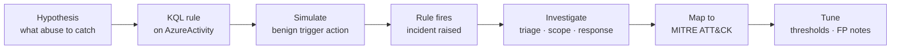

# Methodology

## Detection-engineering loop

Every detection in this repo went through the same closed loop. A detection that has never fired is unproven, so each rule is exercised against real telemetry:

1. **Hypothesis** — pick an Azure control-plane abuse worth catching (privilege change, defensive-control tampering, destruction, suspicious deployment, recon-by-failure).
2. **Rule** — express it as a scheduled Sentinel analytics rule over `AzureActivity`.
3. **Simulate** — perform the matching action benignly against my own resources (see `simulations/trigger-playbook.md`) and revert it.
4. **Fire** — confirm the scheduled rule raises an incident.
5. **Investigate** — triage the incident, scope it with KQL pivots, decide response.
6. **Map** — assign MITRE tactic + technique.
7. **Tune** — record threshold rationale and false-positive considerations.

## MITRE ATT&CK mapping

Each detection is tagged with one primary tactic/technique, carried through the rule metadata, the detection card, and the incident. The catalog spans Discovery, Defense Evasion, Privilege Escalation/Persistence, and Impact — a deliberate cross-section of the cloud kill chain rather than five variations of one technique.

## Severity rationale

- **High** — irreversible or high-blast-radius impact (mass deletion → T1485).
- **Medium** — reconnaissance, configuration tampering, and privilege changes that are strong signals but not themselves destructive.

## Why scheduled analytics rules

Scheduled rules run on a fixed query interval against the workspace, so detection is decoupled from the simulated action — exactly how a production SOC sees activity after the fact. This also means an incident appears on the rule's next run, not instantly; the lag is expected and documented per detection.
