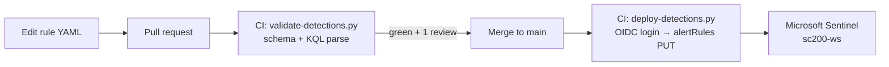

# CI/CD — Detection-as-Code

Detection rules are **code**. They live as YAML in `detections/rules/`, are reviewed via pull request, and reach Microsoft Sentinel **only** through a pipeline — never hand-deployed. Authentication uses **OIDC federated credentials**, so no client secret is ever stored.

## Flow



- **PR** → `validate` job runs `cicd/validate-detections.py` (YAML schema, GUID, severity, ISO-8601 durations, technique IDs; optional KQL `| take 0` parse). Branch protection requires this check + 1 review before merge.
- **Merge to main** → `deploy` job runs `cicd/deploy-detections.py`: OIDC login, then an **idempotent PUT** of each rule to `alertRules/{id}` (API `2025-09-01`). Reusing each rule's GUID means deploys **update in place** — no duplicates.

## Source of truth

Each rule is one YAML file in `detections/rules/` (Azure-Sentinel format) carrying both the deployable fields and a `metadata:` block (FP sources, required fields, ATT&CK, atomic mapping, response action) consumed by the docs, ignored by the deployer.

> **API version:** `2025-09-01`. Microsoft Sentinel deprecates older alertRules API versions on **2026-06-15**; the deployer targets the current version.

## OIDC setup (one-time)

No secrets in the repo — GitHub requests a short-lived token at run time and Azure validates it.

```bash
APP_ID=$(az ad app create --display-name gha-azure-soc-detection-lab --query appId -o tsv)
az ad sp create --id "$APP_ID"
SUB=$(az account show --query id -o tsv)

# federated credentials: main branch (deploy) + pull requests (validate)
az ad app federated-credential create --id "$APP_ID" --parameters '{
  "name":"gha-main","issuer":"https://token.actions.githubusercontent.com",
  "subject":"repo:ibondarenko1/azure-soc-detection-lab:ref:refs/heads/main",
  "audiences":["api://AzureADTokenExchange"]}'
az ad app federated-credential create --id "$APP_ID" --parameters '{
  "name":"gha-pr","issuer":"https://token.actions.githubusercontent.com",
  "subject":"repo:ibondarenko1/azure-soc-detection-lab:pull_request",
  "audiences":["api://AzureADTokenExchange"]}'

# least-privilege role on the workspace RG
az role assignment create --assignee "$APP_ID" --role "Microsoft Sentinel Contributor" \
  --scope "/subscriptions/$SUB/resourceGroups/sc200-lab"
```

Then set **repository variables** (Settings → Secrets and variables → Actions → Variables — these are IDs, not secrets):

| Variable | Value |
|----------|-------|
| `AZURE_CLIENT_ID` | the app's `appId` |
| `AZURE_TENANT_ID` | tenant ID |
| `AZURE_SUBSCRIPTION_ID` | subscription ID |
| `SENTINEL_WORKSPACE_GUID` | (optional) Log Analytics `customerId` for the PR KQL-parse check |

## Run locally

```bash
pip install pyyaml
az login
python cicd/validate-detections.py        # schema (+ KQL if SENTINEL_WORKSPACE_GUID set)
python cicd/deploy-detections.py           # upsert rules to sc200-ws
```
