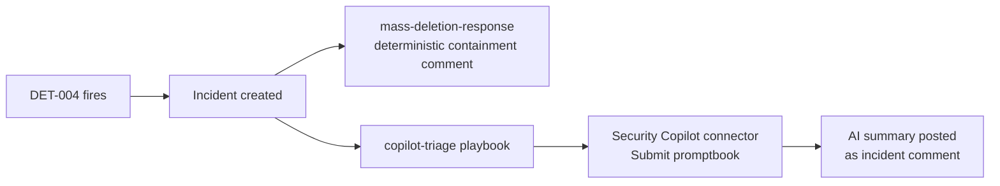

# 06, Security Copilot AI triage (detect → respond → investigate)

This repo already closes **detect → respond**: the [`mass-deletion-response`](../playbooks/mass-deletion-response)
playbook posts deterministic containment guidance on every DET-004 (Mass resource deletion)
incident. Phase K adds the **investigate** step with **Microsoft Security Copilot**: a second
playbook invokes a Copilot **promptbook** that produces an AI investigation summary and posts it
back as an incident comment.

- Promptbook: [`copilot/promptbooks/det-004-mass-deletion-triage.yaml`](../copilot/promptbooks/det-004-mass-deletion-triage.yaml)
- Playbook: [`playbooks/copilot-triage`](../playbooks/copilot-triage)
- Reference: Microsoft [`Azure/Security-Copilot`](https://github.com/Azure/Security-Copilot) Logic Apps samples · Learn: [connector-logicapp](https://learn.microsoft.com/copilot/security/connector-logicapp), [security-compute-units-capacity](https://learn.microsoft.com/copilot/security/security-compute-units-capacity)

## Status

**Built and free-rehearsable; live AI summary not yet captured.** The promptbook, the Logic App,
and the automation rule are authored and deploy without any SCU (the Sentinel trigger and the
managed-identity comment write run for free; only the Copilot action stays pending until capacity
is provisioned). The live AI-summary capture (`screenshots/12-copilot-triage-comment.png`) and the
teardown shot (`screenshots/13-copilot-capacity-deleted.png`) are produced during the single paid
~1-hour window described below, and are not claimed until then. This page states the current
position rather than a firing that has not happened.

## Why a promptbook (not just embedded Copilot)
Embedded "Copilot in Defender" already summarizes incidents in the portal, useful, but a manual
click. The **promptbook + Logic App** is the *engineering* artifact: a versioned, repeatable,
SOAR-triggered investigation that runs automatically on the High-severity detection and writes its
output where the analyst already works (the incident comment thread). The promptbook is source in
this repo, deployed like every other detection asset.

## Cost, read before provisioning
Security Copilot bills on **provisioned Security Compute Units (SCU)**:

| Item | Value |
|------|-------|
| Price | **$4 / SCU / hour** (provisioned); $6/hr overage |
| Minimum capacity | **1 SCU** |
| Billing granularity | **whole-hour blocks, 1-hour minimum** |
| 1 SCU for one hour | **≈ $4** |
| 1 SCU left running 24×30 | ≈ $2,880 / month ← do **not** do this |

**Strategy:** everything in this repo is built and rehearsed **for free**; capacity is provisioned
**only** for a single ~1-hour live-capture window, then **deleted**. Target spend **$4**, worst case
**$8** if it slips into a second hour. *Deleting capacity is permanent and stops billing.*

## Runbook

### Phase K0, free (no SCU)
1. Deploy the playbook: `az deployment group create -g sc200-lab -n pb-copilot-triage --template-file playbooks/copilot-triage/azuredeploy.json`. It deploys and the **Sentinel trigger fires without any SCU**; only the Copilot action stays pending.
2. Grant the playbook MI **Microsoft Sentinel Responder** + the Azure Security Insights SP **Automation Contributor** (see the playbook README).
3. Rehearse the trigger + comment path with a temporary echo (skip the Copilot action) and confirm the DET-004 simulation raises an incident (see [`simulations/trigger-playbook.md`](../simulations/trigger-playbook.md)).
4. Confirm the **two designer bindings** (Copilot operation + output field) are ready to set.

### Phase K1, paid window (~1 hour, ≈ $4), operator drives the portal
1. **Provision 1 SCU** capacity + complete first-run onboarding (Security Copilot portal). Note capacity name/region.
2. **Import** the promptbook (My promptbooks → Create) and **authorize** the `securitycopilot` Logic Apps connection (one-time OAuth consent).
3. **Fire** DET-004 (`az` simulation) → incident created → automation rule runs the playbook → promptbook evaluates → **AI summary posted as a comment**. → 📸 `screenshots/12-copilot-triage-comment.png`
4. Bonus: open the same incident in **Defender XDR** and screenshot the **embedded Copilot** summary.
5. **Delete the provisioned capacity** → confirm billing stopped. → 📸 `screenshots/13-copilot-capacity-deleted.png`

### Hard stop / fallback
If the custom promptbook or connection isn't working ~35 min in, switch to Microsoft's curated
**"Triage a Sentinel incident"** promptbook; if still failing, capture the **embedded
Copilot-in-Defender** summary so the hour still yields a live artifact, then delete capacity regardless.

## Auth / security
- Incident-comment write: playbook **system-assigned managed identity** → ARM `/comments` (no secret).
- `securitycopilot` connection: one-time interactive (user-delegated) OAuth consent; confirm whether your tenant's connector supports a service-principal connection and prefer that if available.
- Nothing in this repo stores a token or key.
