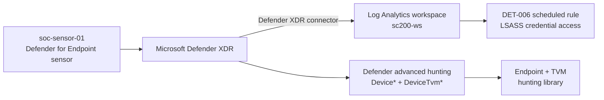

# Endpoint telemetry and vulnerability management

The first five detections read the Azure control plane (`AzureActivity`). This phase adds the
endpoint plane: a Defender for Endpoint sensor on a Windows server, its telemetry feeding the
same workspace the analytics rules run in, and Defender Vulnerability Management (TVM) as a
second input to both detection and hardening.

## The sensor

A Windows Server 2022 host (`soc-sensor-01`) is onboarded to Microsoft Defender for Endpoint
with the Defender deployment tool (`defenderdt`) and the tenant onboarding package. Onboarding
is verified on the host, not assumed:

- `OnboardingState = 1` under `HKLM\SOFTWARE\Microsoft\Windows Advanced Threat Protection\Status`
- the `Sense` service running
- the device reporting **Active** in Device Inventory with a sensor health state, OS build, and
  last-seen timestamp

Once the sensor is healthy it streams device events and the cloud runs continuous vulnerability
assessment against the host's software inventory.

## How endpoint telemetry reaches the detections

Two surfaces, on purpose:

- **`Device*` event tables** (`DeviceEvents`, `DeviceProcessEvents`, `DeviceInfo`,
  `AlertEvidence`) stream into `sc200-ws` through the Defender XDR connector, so a Sentinel
  scheduled analytics rule can run against them. That is how **DET-006** is deployed, through
  the same Detection-as-Code pipeline as the AzureActivity rules.
- **`DeviceTvm*` tables** (software inventory, software vulnerabilities, secure configuration
  assessment) live in Defender advanced hunting, not in the Sentinel workspace. The vulnerability
  correlations are therefore kept as a **hunting library** ([`kql/hunting`](../kql/hunting))
  meant to be run in the Defender portal, not as deployed Sentinel rules. Calling that out is the
  point: the deployed rule sits where its data actually is.

## Vulnerability management as a detection and hardening input

TVM is read two ways here:

1. **Prioritization.** A weakness matters more on a host that is also under an active alert. The
   hunt [`endpoint-vulnerable-asset-under-alert.kql`](../kql/hunting/endpoint-vulnerable-asset-under-alert.kql)
   joins `AlertEvidence` to `DeviceTvmSoftwareVulnerabilities` on `DeviceId`, so a vulnerable
   asset under attack rises to the top instead of sitting in a flat CVE list.
2. **Hardening feedback.** Failed secure-configuration checks
   ([`endpoint-failed-security-baseline.kql`](../kql/hunting/endpoint-failed-security-baseline.kql))
   and the exposure score are the close-the-loop signal: a detection that fires on a
   misconfiguration should have a matching recommendation to remove the misconfiguration.

## What this phase adds

| Artifact | Engine | Purpose |
|----------|--------|---------|
| [DET-006](../detections/DET-006-lsass-credential-access.md) | Sentinel scheduled rule | LSASS credential access (T1003.001) on `Device*` telemetry |
| [`endpoint-lsass-access.kql`](../kql/hunting/endpoint-lsass-access.kql) | Defender advanced hunting | companion hunt for the DET-006 behavior |
| [`endpoint-critical-cve-exposed-server.kql`](../kql/hunting/endpoint-critical-cve-exposed-server.kql) | Defender advanced hunting | critical CVEs on server-role hosts |
| [`endpoint-failed-security-baseline.kql`](../kql/hunting/endpoint-failed-security-baseline.kql) | Defender advanced hunting | failed secure-configuration assessments |
| [`endpoint-vulnerable-asset-under-alert.kql`](../kql/hunting/endpoint-vulnerable-asset-under-alert.kql) | Defender advanced hunting | vulnerable asset correlated with an active alert |

## Status

The sensor is onboarded and reporting Active. DET-006 is authored and validated against the
`Device*` schema. Its live witness, a controlled LSASS-access trigger raising an incident, plus
the TVM weakness and secure-score screenshots, are added once the endpoint completes its first
vulnerability assessment cycle. Until then the rule is deployed and the hunts are runnable, and
this page says so rather than claiming a firing that has not happened yet.
