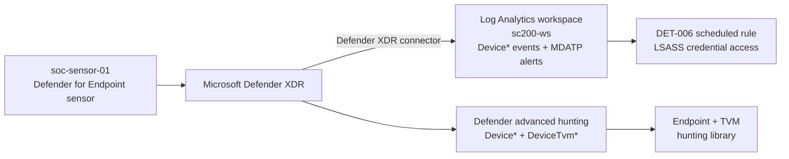

# Endpoint telemetry and vulnerability management

The control-plane detections read the Azure Activity Log (`AzureActivity`). This phase adds the
endpoint plane: a Defender for Endpoint sensor on a Windows host, its telemetry feeding the
same workspace the analytics rules run in, and Defender Vulnerability Management (TVM) as a
second input to both detection and hardening.

## The sensor

A Windows 11 host (`soc-sensor-01`) is onboarded to Microsoft Defender for Endpoint
with the Defender deployment tool (`defenderdt`) and the tenant onboarding package. Onboarding
is verified on the host, not assumed:

- `OnboardingState = 1` under `HKLM\SOFTWARE\Microsoft\Windows Advanced Threat Protection\Status`
- the `Sense` service running
- the device reporting **Active** in Device Inventory with a sensor health state, OS build, and
  last-seen timestamp

Once the sensor is healthy it streams device events and the cloud runs continuous vulnerability
assessment against the host's software inventory.

## How endpoint telemetry reaches the detections

Two surfaces, on purpose:

- **`Device*` event tables** (`DeviceEvents`, `DeviceProcessEvents`, `DeviceFileEvents`,
  `DeviceNetworkEvents`, `DeviceInfo`) and **MDATP alerts** (`SecurityAlert`) are streamed into
  `sc200-ws` through the Defender XDR connector (the connector's event-streaming toggle), so a
  Sentinel scheduled analytics rule can run against them. That is how **DET-006** is deployed,
  through the same Detection-as-Code pipeline as the AzureActivity rules.
- **`DeviceTvm*` tables** (software inventory, software vulnerabilities, secure configuration
  assessment) are **not** streamed into the workspace by the connector; they live in Defender
  advanced hunting as daily snapshots. The vulnerability correlations are therefore kept as a
  **hunting library** ([`kql/hunting`](../kql/hunting)) run there, while DET-006 is the one
  scheduled rule on the streamed event and alert tables.

## Vulnerability management as a detection and hardening input

TVM is read two ways here:

1. **Prioritization.** A weakness matters more on a host that is also under an active alert. The
   hunt [`endpoint-vulnerable-asset-under-alert.kql`](../kql/hunting/endpoint-vulnerable-asset-under-alert.kql)
   joins `AlertEvidence` to `DeviceTvmSoftwareVulnerabilities` on `DeviceId`, so a vulnerable
   asset under attack rises to the top instead of sitting in a flat CVE list.
2. **Hardening feedback.** Failed secure-configuration checks
   ([`endpoint-failed-security-baseline.kql`](../kql/hunting/endpoint-failed-security-baseline.kql))
   and the exposure score are the close-the-loop signal: a detection that fires on a
   misconfiguration should have a matching recommendation to remove the misconfiguration.

## What this phase adds

| Artifact | Engine | Purpose |
|----------|--------|---------|
| [DET-006](../detections/DET-006-lsass-credential-access.md) | Sentinel scheduled rule | LSASS credential access (T1003.001) on `Device*` telemetry + MDATP alerts |
| [`endpoint-lsass-access.kql`](../kql/hunting/endpoint-lsass-access.kql) | Defender advanced hunting | companion hunt for the DET-006 behavior |
| [`endpoint-critical-cve-exposed.kql`](../kql/hunting/endpoint-critical-cve-exposed.kql) | Defender advanced hunting | critical/high CVEs by exposed software, KB-scored |
| [`endpoint-failed-security-baseline.kql`](../kql/hunting/endpoint-failed-security-baseline.kql) | Defender advanced hunting | failed secure-configuration assessments |
| [`endpoint-vulnerable-asset-under-alert.kql`](../kql/hunting/endpoint-vulnerable-asset-under-alert.kql) | Defender advanced hunting | vulnerable asset correlated with an active alert |

## Status

The sensor is onboarded and reporting **Active** in Defender XDR. The `Device*` event tables and
MDATP alerts stream into `sc200-ws` through the Defender XDR connector (verified row counts in
`DeviceProcessEvents`, `DeviceFileEvents`, `DeviceNetworkEvents`, `DeviceInfo`, and `SecurityAlert`).
The `DeviceTvm*` tables stay in Defender advanced hunting, where the hunts run.

**DET-006 is live and witnessed.** Three LSASS credential-dump techniques were run against the
sensor (`comsvcs.dll` MiniDump via PowerShell, `procdump -ma lsass`, and a P/Invoke `OpenProcess`).
The host is hardened (LSASS RunAsPPL, AMSI, and Defender behavioral protection), so every attempt
was prevented and the read never succeeded. Each prevention raised an MDATP alert
("`Lsassdump` hacktool prevented via AMSI", "`DumpLsass` hacktool in a command line was prevented")
that streamed to `SecurityAlert`, and DET-006 fires on those signals. The detection is multi-source
by design: it fuses the api-level handle open, the process-level dump-tool command line, and the
Defender prevention alert, so it fires whether the dump runs or is blocked. See
[INV-03](../investigations/INV-03-lsass-credential-access.md) for the full witness trail.

TVM is populated and queried in advanced hunting: 25 CVEs on the host (5 Critical, 9 High; OpenSSL
at CVSS 9.8) and 58 failed secure-configuration checks across Firewall, ASR, OS, Network, and
Accounts categories. The four hunts in [`kql/hunting`](../kql/hunting) return these rows directly.

## Evidence

The sensor is Active and onboarded in Device Inventory:

DET-006 sits in the deployed catalog as `[DET] LSASS credential access`, one of six pipeline-deployed rules:

The LSASS dump attempts raised an endpoint incident on `soc-sensor-01`:

Defender Vulnerability Management surfaces the OpenSSL critical CVEs (CVSS 9.8):

