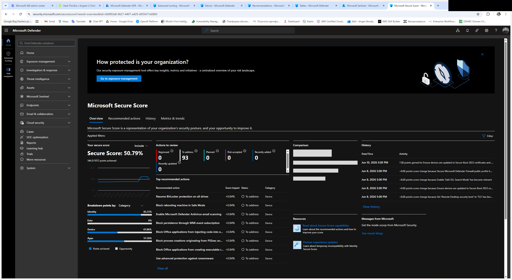
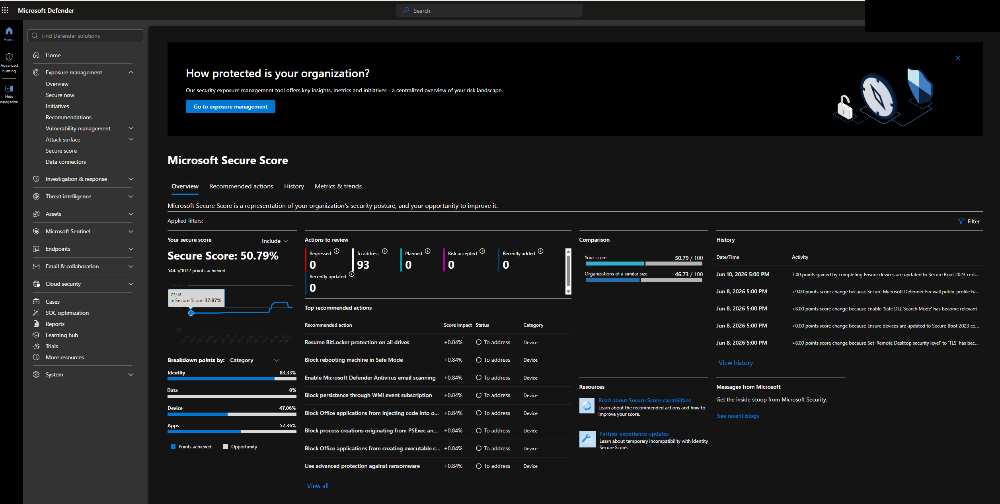
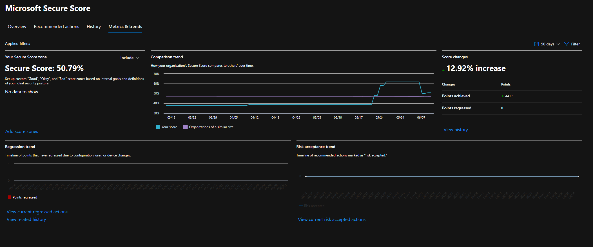
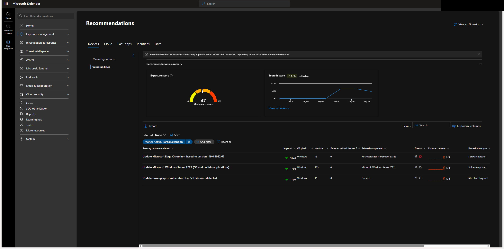
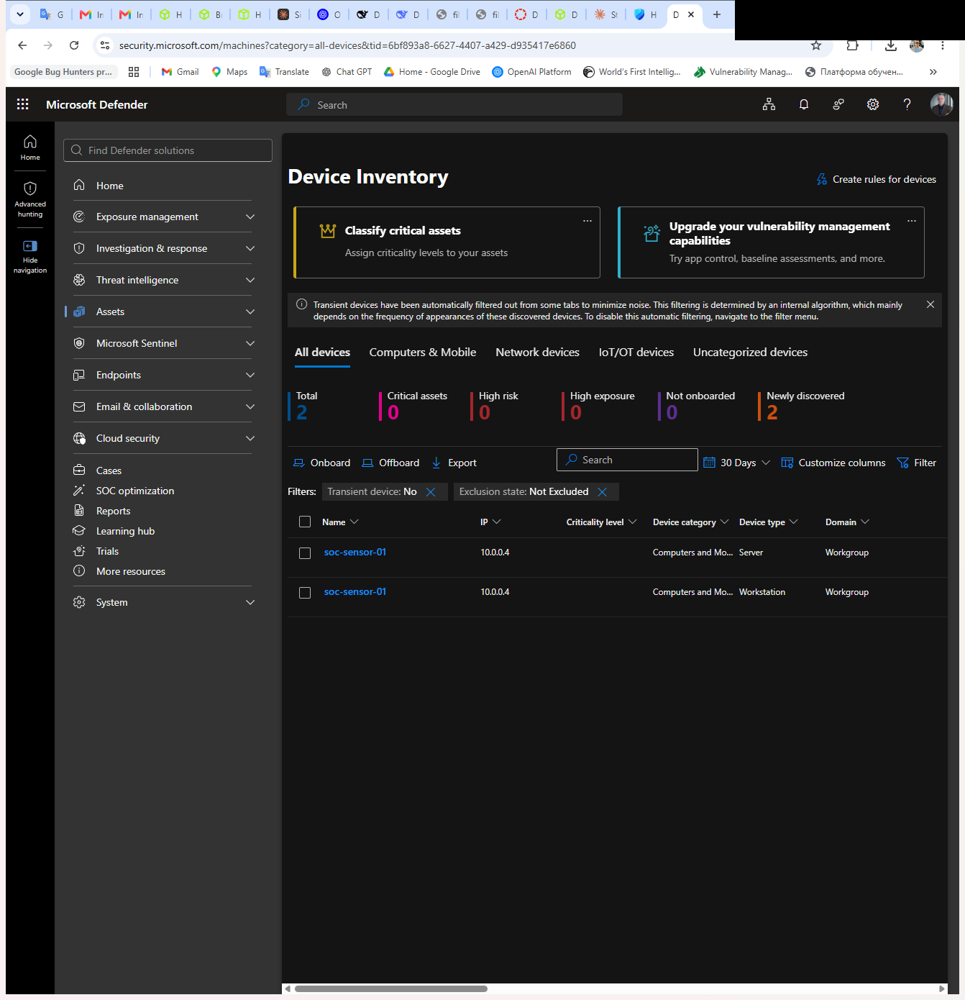
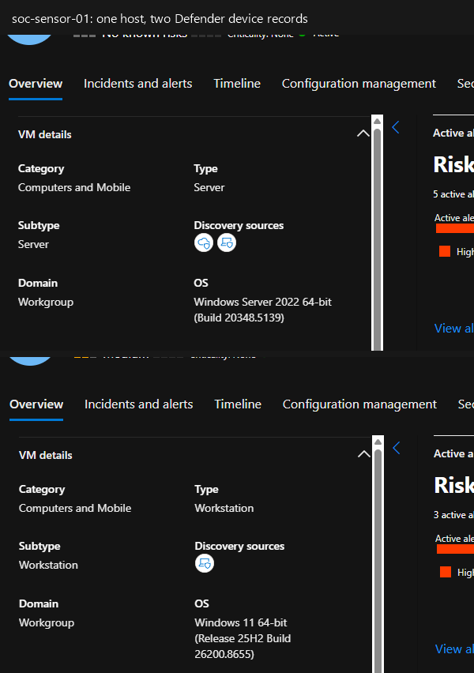
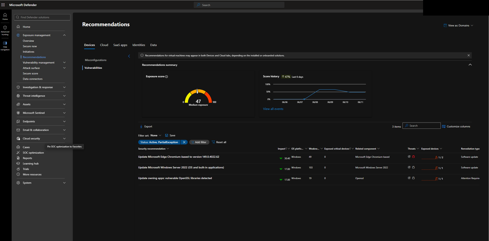

# Posture remediation: a measured Secure Score loop tied back to the detections

The catalog detects, investigates, and responds. This is the other half of the job: reading the
tenant's own posture score, fixing what it flags, and proving the number moved. It is the same
discipline as the [tuning case study](09-tuning-case-study.md), applied to posture instead of a
single rule: baseline, prioritize, remediate, then **measure** rather than assert.

## The loop

```
baseline -> prioritize -> remediate -> measure (re-score) -> track the rest
```

## Two scores, kept apart

There are two Secure Scores in this tenant and they measure different planes. Conflating them is the
usual mistake.

| Score | Plane | Current value | Source |
|-------|-------|---------------|--------|
| Microsoft 365 Secure Score | identity, apps, data, device | **50.14%**, 94 actions to review | Defender portal ([screenshot](../screenshots/12-secure-score-current.png)) |
| Defender for Cloud Secure Score | Azure resource posture | **68.81%** (21.33 / 31) | ARM `Microsoft.Security`, pulled by [collect-posture.ps1](../posture/collect-posture.ps1) |
| Exposure score | device / vulnerability exposure | **65 / 100**, Medium, trending | Exposure Management ([screenshot](../screenshots/14-exposure-recommendations.png)) |

The Defender for Cloud score is the one driven here because it is the Azure-resource plane these
detections live on, and it is pullable as a [machine-readable snapshot](../posture/snapshots) so the
before/after is a file diff, not a screenshot comparison. The M365 score and the exposure score are
captured from the portal because their APIs (Graph `security/secureScores`, exposure management) need
a consented app the az CLI token does not carry; that limitation is recorded rather than hidden. The
M365 actions-to-review climbed from 32 to 94 as the tenant accumulated data, which is what dropped the
percentage even though nothing regressed: more applicable controls means a larger denominator.


## Baseline (before)

Pulled with `collect-posture.ps1` into [`posture/snapshots/2026-06-10-baseline.json`](../posture/snapshots/2026-06-10-baseline.json).
The score is one number; the useful part is the per-control breakdown, which says exactly where the
9.67 missing points sit. Every scored point that is not yet earned is in four controls:

| Control | Earned / available | Unhealthy resources | Points on the table |
|---------|--------------------|--------------------|---------------------|
| Enable encryption at rest | 0 / 4 | 1 | **4.00** |
| Manage access and permissions | 1.33 / 4 | 2 | 2.67 |
| Restrict unauthorized network access | 2 / 4 | 1 | 2.00 |
| Enable auditing and logging | 0 / 1 | 2 | 1.00 |
| Enable enhanced security features | 0 / 0 | 1 | 0 (plan upgrade, no score weight) |
| Implement security best practices | 0 / 0 | 2 | 0 (no score weight) |

Already at 100%: secure management ports, encrypt data in transit, apply system updates. Closing the
four point-bearing controls is the entire path from 68.81% to 100%. Across the subscription this is
18 unhealthy assessments behind those controls.

## Prioritize

Ranked by blast radius first, then score value. A posture fix that breaks the environment is not a win,
so the order runs from additive-and-reversible to higher-effort, and the licensing-gated items are
called out as accepted risk rather than pretended into the backlog as quick wins.

## Remediate: execution order

1. **Security contact + high-severity alert notifications.** Additive, reversible, no score weight
   but it closes three open recommendations and is the correct first move. Ready to run:
   [`remediate-quickwins.ps1`](../posture/remediate-quickwins.ps1) (dry-run by default, `-Apply` to
   execute).
2. **Diagnostic logs on the SOAR Logic Apps.** Turns on logging for the repo's own
   [mass-deletion-response](../playbooks/mass-deletion-response) and
   [copilot-triage](../playbooks/copilot-triage) playbooks, routed to `sc200-ws`. Additive, and it
   earns the "Enable auditing and logging" point (+1). Logging is also the precondition for the
   detections themselves, so this one closes a posture gap and protects the telemetry in the same
   action.
3. **Encryption at host on the sensor VM.** Earns "Enable encryption at rest" (+4), the single
   biggest item. Requires deallocating `soc-sensor-01`, setting `securityProfile.encryptionAtHost`,
   and starting it back up, so it runs in a short maintenance window.
4. **Storage hardening: restrict network access, disable shared-key.** Earns "Restrict unauthorized
   network access" (+2). The only storage account here is the Defender for Endpoint managed sensor
   store, so flipping shared-key or network rules risks the sensor upload path; held as backlog with
   that reason rather than flipped blind.
5. **Access and permissions: a break-glass second owner, review excess role holders.** Earns "Manage
   access and permissions" (+2.67). Needs a second principal, so it is backlog.

### Applied this session, verified at the resource level

| Fix | Action | Verified | Control |
|-----|--------|----------|---------|
| Security contact + alert notifications | `securityContacts/default` set, alert + owner notify On | contact state `On` | Enhanced features (0 wt) |
| Diagnostic logs on both playbooks | `diag-to-sentinel` setting to `sc200-ws`, WorkflowRuntime logs on | both `logsEnabled: true` | Auditing and logging (+1) |
| Encryption at host on `soc-sensor-01` | deallocate, set `encryptionAtHost=true`, start | `encryptionAtHost: True`, power `VM running` | Encryption at rest (+4) |

These are confirmed at the resource level. Defender for Cloud re-evaluates the matching assessments
on its own scan cycle (hours), and the Secure Score recalculates after that (24 to 72 hours), so the
Unhealthy-to-Healthy flip and the score delta land on the after snapshot, not instantly. Items 4 and
5 stay in the backlog below for the reasons given.

## Closing the loop back to the detections

This is posture work owned by a detection engineer, so each item is mapped to the rule that catches
its regression. Hardening removes the exposure; the detection tells you when it comes back.

| Remediation | Removes | Regression caught by |
|-------------|---------|----------------------|
| Diagnostic logs + auditing | blind spots in the control-plane log | the whole catalog reads `AzureActivity`; losing it blinds [DET-001](../detections/DET-001-failed-activity-log-spike.md) through DET-009 |
| Storage network restriction / no shared-key | public reachability of a resource | [DET-002](../detections/DET-002-nsg-rule-modified.md), [DET-009](../detections/DET-009-nsg-opened-inbound-any.md) (network-exposure change class) |
| Break-glass owner / least privilege | privilege sprawl | [DET-003](../detections/DET-003-rbac-role-assignment-changes.md), [DET-007](../detections/DET-007-rbac-grant-then-deploy.md) |
| Encryption at host | data-at-rest exposure | posture-only, no runtime rule, tracked as a coverage gap |
| Defender for servers (backlog) | endpoint detection coverage | [DET-006](../detections/DET-006-lsass-credential-access.md) depends on the Defender for Endpoint signal |
| Defender for Resource Manager (backlog) | control-plane threat detection | complements DET-001 / DET-003 / DET-005 / DET-007 |

## The rest: tracked backlog

Carried forward, prioritized, not silently dropped:

- **Licensing-gated (accepted risk for a single-operator environment):** enable Defender for Servers, for
  Storage, for Resource Manager, and CSPM. These move the score and add real detection coverage but
  carry per-resource cost; only Discovery and FoundationalCspm run on Standard today. Documented as
  accepted risk with the cost rationale, the same call the posture audit tooling makes.
- **Blast-radius held:** the storage account is the Defender for Endpoint managed sensor store, so
  shared-key and VNet-rule hardening wait until the sensor upload path is confirmed independent of
  them, rather than being flipped on the one storage account the endpoint plane depends on.
- **Effort-gated:** storage private link, Azure Backup, guest configuration / attestation extensions,
  and the break-glass second owner.

## Measure (after): the score moved on two of three planes

Re-pulled 2026-06-11 ([`posture/snapshots/2026-06-11-after.json`](../posture/snapshots/2026-06-11-after.json)
for the Defender for Cloud plane; portal captures for the M365 and exposure planes).

| Plane | Before (06-10) | After (06-11) | Delta | Evidence |
|-------|----------------|---------------|-------|----------|
| Microsoft 365 Secure Score | 50.14%, 94 actions | **50.79%, 93 actions** | **+7.00 points** (Secure Boot 2023 certificates) | [16](../screenshots/16-secure-score-after.png), [21](../screenshots/21-secure-score-history.png), [22](../screenshots/22-secure-score-trend.png) |
| Exposure score | 65 (Medium) | **47 (Medium)** | **-18** (lower is better), 4 recs to 3 | [19](../screenshots/19-exposure-after.png), [20](../screenshots/20-exposure-device-recommendations.png) |
| Defender for Cloud Secure Score | 68.81% (21.33/31) | 68.81% | 0, re-scan pending | snapshot JSON |

**What moved and why.** Item 3 of the plan (encryption at host) deallocated and restarted
`soc-sensor-01`. On reboot the sensor installed pending Windows updates and picked up the Secure Boot
2023 certificates. That cleared the "Update Windows 11" exposure recommendation (exposure 65 to 47)
and earned the M365 Secure Boot action (+7 points). The maintenance window for the encryption fix
paid out on two adjacent score planes before its own Defender for Cloud control even re-evaluated.
The Secure Score History panel records this as a discrete entry, "7.00 points gained by completing
Ensure devices are updated to Secure Boot 2023 cert..." dated 06-10
([21](../screenshots/21-secure-score-history.png)), and the 90-day Metrics and trends view shows the
cumulative climb: +12.92%, 441.5 points achieved, 0 regressed
([22](../screenshots/22-secure-score-trend.png)).

**Defender for Cloud is still flat, by scan cadence not by failure.** The three DfC fixes are
confirmed at the resource level (encryptionAtHost=true, diagnostic settings logsEnabled, security
contact On), but the free-tier CSPM scanner re-evaluates assessments on its own cycle, so the
encryption-at-rest (+4) and auditing (+1) controls have not flipped yet. Those points land on the
next snapshot. Measured, not assumed.

A second after-pull a day later
([`2026-06-12-after2.json`](../posture/snapshots/2026-06-12-after2.json)) is byte-identical to the
06-11 snapshot: 68.81%, the same eight controls below 100%, encryption-at-rest and auditing still
showing their unhealthy resources. The three resource-level fixes were re-checked the same day and all
still hold (security contact `On`, `encryptionAtHost: True`, both playbooks' `diag-to-sentinel`
WorkflowRuntime logs enabled to `sc200-ws`). So the flat score is the free-tier scan interval, not a
reverted change. The honest read on this plane is that the fix is done and the score has a lag, and
the snapshot diff is what proves which of the two it is.

**One device, two records (not a deletion).** Defender inventory shows two device entries, both
`soc-sensor-01` at the same IP, classified Server and Workstation. That is the single Azure VM
dual-classified, not two machines, and the Azure Activity Log shows zero delete operations across
all providers, so nothing was removed.













**The direct exposure recommendations, executed and verified.** Three software-update
recommendations sat on the sensor: update Edge, update Windows, and update apps with a vulnerable
OpenSSL library. `soc-sensor-01` is drivable through `az vm run-command`, so each was actioned and
the result read back at the device level rather than waiting on the portal
([device-verification snapshot](../posture/snapshots/2026-06-12-device-verification.json)):

| Recommendation | Action | Verified state | Status |
|----------------|--------|----------------|--------|
| Update Microsoft Edge | run-command update | Edge `149.0.4022.62` (the exact target build), reboot pending `False` | Resolved |
| Update Windows | run-command Windows Update, pending count read back | `0` pending updates, `RebootPending False` | Resolved |
| Vulnerable OpenSSL library | located the file | `C:\Windows\System32\libcrypto.dll` (3.8.2.0), an OS-image component (Windows OpenSSH) | System-owned, accepted |

The single VM reports as **Windows 11 Pro**, fully patched. The "Windows Server 2022" wording in the
recommendation is the duplicate Server classification of this one host, not a second machine to patch.
The OpenSSL item is a system library shipped with the OS image, so its fix path is the Windows
servicing channel rather than an app uninstall, and it is tracked as system-owned rather than pretended
into a quick win. Microsoft Defender for Endpoint re-evaluates the exposure recommendations on its own
scan cycle, the same cadence caveat as Defender for Cloud below, so the device-level truth here is the
`az vm run-command` read-back, not the portal tile.



## Lesson

A posture score is only credible the same way a detection is: not when you claim it, but when you can
show the measured before and after. Keeping the baseline in a diffable JSON, ordering the fixes by
blast radius, and mapping each one to the rule that catches its regression is what makes this
detection engineering rather than a screenshot of a number.
