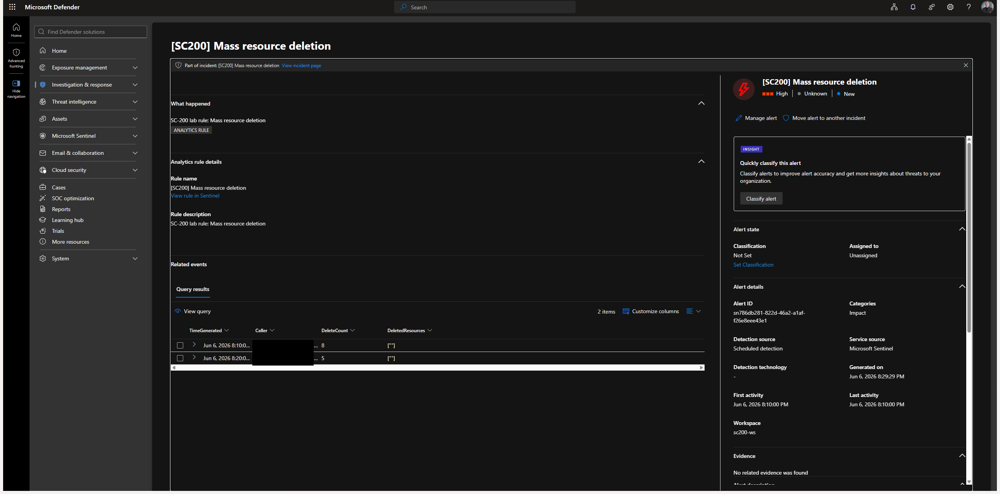

# INV-01, Mass resource deletion (High)

> Investigation write-up for the incident raised by [DET-004](../detections/DET-004-mass-resource-deletion.md). Fields marked _(fill)_ are completed from the live incident.

| | |
|---|---|
| **Incident ID** | #3 |
| **Detection** | DET-004, Mass resource deletion |
| **Severity** | High |
| **MITRE** | Impact → [T1485 Data Destruction](https://attack.mitre.org/techniques/T1485/) |
| **Status** | New |

## 1. Triage

- **What fired:** a single caller deleted ≥5 distinct resources within one hour.
- **Caller:** `ievgen@<redacted-tenant>` (redacted in screenshots)
- **Source IP:** _(captured in incident screenshot)_
- **Time window:** simulated deletes 2026-06-07 ~03:16–03:26 UTC; incident raised 03:29 UTC



The alert's **Related events / Query results** show the caller and the per-5-minute delete counts (8 and 5) that crossed the `>= 5` threshold.

## 2. Scope

Pivot in Advanced hunting to bound the activity, what else did this caller do around the deletion?

```kql
let actor = "<caller>";
let t0 = datetime(<incident-start>);
AzureActivity
| where TimeGenerated between ((t0 - 2h) .. (t0 + 2h))
| where Caller == actor
| summarize Ops = count() by OperationNameValue, ActivityStatusValue
| order by Ops desc
```

- Resources destroyed: _(fill, list/count)_
- Preceding activity (recon, role changes): _(fill)_
- Other principals involved: _(fill)_

## 3. Assessment

- **Determination:** _(true positive simulation / benign)_
- **Blast radius:** _(fill)_
- **Root cause:** benign simulated bulk delete of `rg-sim-delete` (controlled benign action), in production this pattern = destructive impact.

## 4. Response

What a SOC would do for a real positive:
1. Disable/quarantine the caller principal; revoke active sessions.
2. Lock the affected resource groups (`CanNotDelete`) to stop further loss.
3. Initiate restore from backup / soft-delete where available.
4. Hunt for the initial access that led to the principal compromise.

## 5. Lessons / tuning

- Confirmed the detection fires reliably on bulk delete.
- Tuning follow-ups: see [DET-004 tuning notes](../detections/DET-004-mass-resource-deletion.md#tuning-notes).
