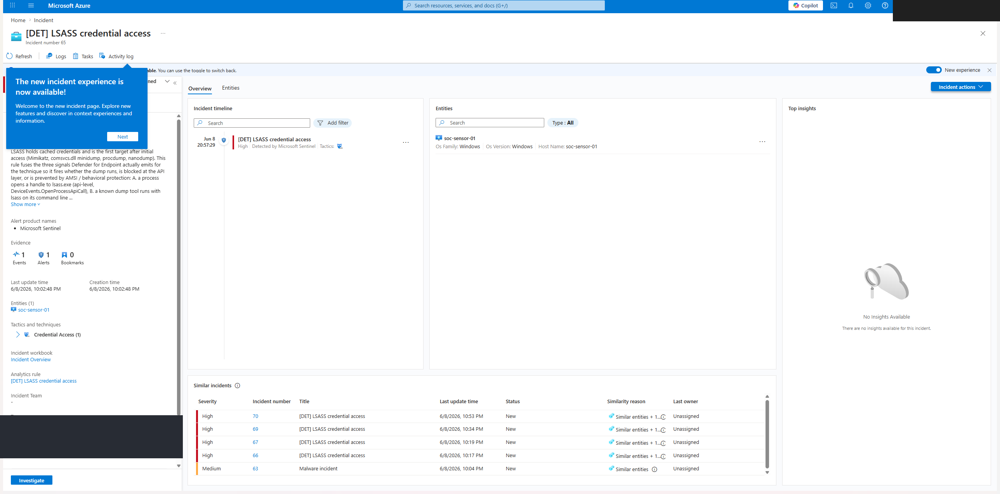

# INV-03, LSASS credential access (High)

> Investigation write-up for the incident raised by [DET-006](../detections/DET-006-lsass-credential-access.md). This is a live witness: the activity, the prevention, and the incident are all real, captured from `sc200-ws` and Defender XDR.

| | |
|---|---|
| **Incident ID** | #65 |
| **Detection** | DET-006, LSASS credential access |
| **Severity** | High |
| **MITRE** | Credential Access → [T1003.001 OS Credential Dumping: LSASS Memory](https://attack.mitre.org/techniques/T1003/001/) |
| **Status** | New |
| **Device** | `soc-sensor-01` (Windows 11, MDE device id `9ded1c58…`) |
| **Raised** | 2026-06-09 05:02:48 UTC |

## 1. Triage

- **What fired:** DET-006 correlated multiple LSASS credential-theft signals on one host inside the look-back window and raised a High incident.
- **Signals in the incident (from `SecurityAlert`, provider MDATP):**
  - `An active 'Lsassdump' hacktool in a PowerShell script was prevented from executing via AMSI` (01:40, 01:43, 05:07 UTC)
  - `An active 'DumpLsass' hacktool in a command line was prevented from executing` (04:49, 04:52, 04:58 UTC)
- **Host:** `soc-sensor-01`, reporting Active in Device Inventory.
- **Account / process tree:** `NT AUTHORITY\SYSTEM`, `cmd.exe → powershell.exe -ExecutionPolicy Unrestricted -File <script>.ps1` (the management channel used to drive the controlled test).



DET-006 raised Sentinel incident #65 with `soc-sensor-01` as the host entity and Credential Access as the tactic. The prevention also raised a Defender incident on the same host (Endpoint / Antivirus), shown in the [incidents queue](../screenshots/05-incidents-queue-populated.png); the [DET-006 rule](../screenshots/02-detection-rules-overview.png) is in the deployed catalog.

## 2. What generated the activity

This was a controlled, authorised credential-access test against an owned sensor, run to witness DET-006. Three standard T1003.001 techniques were attempted:

| Technique | Command | Outcome |
|-----------|---------|---------|
| `comsvcs.dll` MiniDump (LOLBin) | `rundll32 comsvcs.dll, MiniDump <lsass_pid> out.dmp full` | **Blocked by AMSI** at script parse; raised the `Lsassdump` alert |
| ProcDump | `procdump64.exe -accepteula -ma lsass.exe out.dmp` | **Blocked by behavioral protection** at process creation (Defender threat `2147766333`); raised the `DumpLsass` alert |
| Direct handle | P/Invoke `OpenProcess(lsass, PROCESS_VM_READ)` | **Handle denied** by LSASS RunAsPPL (`OpenProcess` returned false) |

The host is hardened: **LSASS RunAsPPL (`RunAsPPL = 2`)**, **AMSI**, and **Defender behavioral protection** are all active. No dump file was ever produced; the credential memory was never read. Each prevention is itself the detection-worthy signal.

## 3. Scope

Pivot in Defender advanced hunting to bound the activity with the companion hunt:

```kql
// kql/hunting/endpoint-lsass-access.kql, every LSASS credential-theft signal MDE emits
let knownGoodReaders = dynamic(["MsMpEng.exe", "MsSense.exe", "SenseIR.exe"]);
let openHandle =
    DeviceEvents
    | where Timestamp > ago(7d)
    | where ActionType == "OpenProcessApiCall" and FileName =~ "lsass.exe"
    | where InitiatingProcessFileName !in~ (knownGoodReaders)
    | project Timestamp, DeviceName, Signal = "Handle open to lsass", Actor = InitiatingProcessFileName, Detail = InitiatingProcessCommandLine;
let prevented =
    AlertInfo
    | where Timestamp > ago(7d)
    | where Title has "lsass" or Title has_any ("DumpLsass", "Lsassdump")
    | join kind=leftouter (AlertEvidence | where EntityType == "Machine") on AlertId
    | project Timestamp, DeviceName, Signal = "Defender-prevented lsass hacktool", Actor = "Defender", Detail = Title;
union openHandle, prevented
| sort by Timestamp desc
```

- Activity is bounded to `soc-sensor-01`; no other host shows LSASS access.
- No successful read: the dump path terminated at the PPL boundary every time.
- Single account (`SYSTEM` via the management channel); no lateral spread.

## 4. Assessment

- **Determination:** true-positive **prevented** attempt (authorised test). The same telemetry from an unknown actor is a confirmed credential-dumping attempt and a High incident.
- **Blast radius:** none. Defense in depth (RunAsPPL + AMSI + behavioral) stopped the read; no credentials were exposed.
- **Detection behaviour:** DET-006's multi-source design is the point. On this hardened host the dump never ran, so an `OpenProcessApiCall`-only rule would have stayed silent. By also reading the process-level command line and the MDATP prevention alert, DET-006 still fires on the blocked attempt, which is exactly the signal a SOC needs.

## 5. Response

What a SOC would do for a real positive:
1. Isolate `soc-sensor-01` from the network (Defender XDR device isolation).
2. Confirm the LSASS read failed (verify RunAsPPL / Credential Guard state on the host).
3. Rotate any credentials that could have been cached on the host as a precaution.
4. Hunt the initial-access vector that placed an operator on the host (companion endpoint hunts).

## 6. Lessons / tuning

- Confirmed DET-006 fires end to end: real attempt → Defender prevention → MDATP alert in `SecurityAlert` → Sentinel Incident #65.
- The hardened-host case (dump prevented, no `OpenProcessApiCall`) is why the rule fuses three telemetry sources rather than keying on the handle-open alone.
- Tuning follow-ups: see [DET-006 tuning notes](../detections/DET-006-lsass-credential-access.md).
